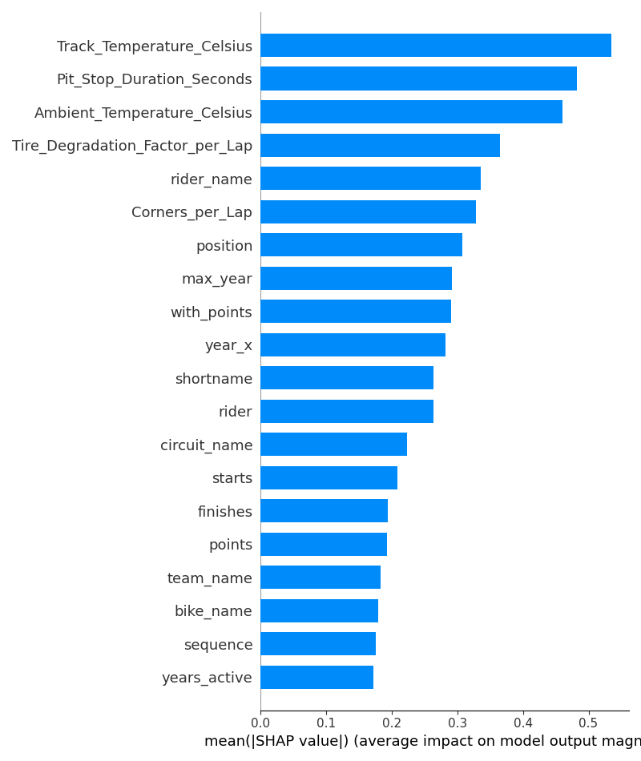

# 🏁 MotoGP Lap Time Prediction – Datathon Challenge

> Predicting rider lap times with machine learning & explainable AI (XAI)

---

## 🚀 Challenge Overview

This project was built for the **IEEE CSMU Burnout Datathon 2025** – a full-day competitive ML event where participants were tasked with predicting **Lap Time in Seconds** (`Lap_Time_Seconds`) for **MotoGP riders** using a complex, real-world dataset.

🗓️ **Duration**: One Day (14 June 2025)  
📁 **Goal**: Achieve the **lowest RMSE** on lap time prediction.  
🎯 **Evaluation Metric**: Root Mean Squared Error (RMSE)

👉 **Challenge Link & Dataset**: [IEEE CSMU Burnout Datathon Dataset on Kaggle](https://www.kaggle.com/competitions/burnout-datathon-ieeecsmuj)

---

## 🔍 Problem Statement

Given rider, bike, and track characteristics, the goal is to predict **Lap_Time_Seconds** with high precision. The dataset contains **1.5M+ rows and 43 features**, demanding efficient modeling and fast experimentation.

---

## 🧠 Approach & Strategy

### 📦 Preprocessing
- Encoded categorical features using `pandas.Categorical`.
- Dropped irrelevant IDs and normalized input features if needed.

### ⚙️ Model: LightGBM
- Chosen for its speed, scalability, and ability to handle large data with minimal preprocessing.
- Tuned hyperparameters for learning rate, depth, and regularization.

### 🔍 Explainability: SHAP
- Used `shap.Explainer` to understand feature impact.
- Generated summary beeswarm and bar plots for interpretability.
- Used SHAP results to prune less impactful features and retrain for better RMSE.

### 💡 Experiments
- Tested 1000–3000 boosting rounds.
- Evaluated feature importance and removed noisy features.
- Used `early_stopping_rounds` and validation-based optimization.

---

## 📈 Results

| Metric           | Score     |
|------------------|-----------|
| ✅ Final RMSE     | **10.16** (initial) → **1.80** (pruned) |
| 📊 SHAP-Aware RMSE | **~1.80** after tuning |

I started from an RMSE of ~10.16 and through **model tuning and SHAP-based feature pruning**, we reduced it to **~1.80**, showing the impact of intelligent XAI-driven refinement.

---

## 📊 Visualizations

### 🔹 SHAP Feature Importance

> ⚠️ **CSV files** (`train.csv`, `test.csv`, etc.) are not included in the repo due to size limits.  
> 📥 Please download them from the [challenge page](https://www.kaggle.com/competitions/csmu-burnout-datathon).

---

## 💬 Reflections

Despite limited time and a huge dataset:
- prioritized a **balance between performance and explainability**
- Applied **model interpretability (SHAP)** to guide pruning, rather than blind hyperparameter tuning
  
---

## 🤝 Author

**Rohan Khandare**  
Final Year IT Engineering Student  
[GitHub](https://github.com/rohan-khandare)

---

## 📌 License

This project is open for learning and experimentation purposes only. Please credit appropriately if using this codebase.

